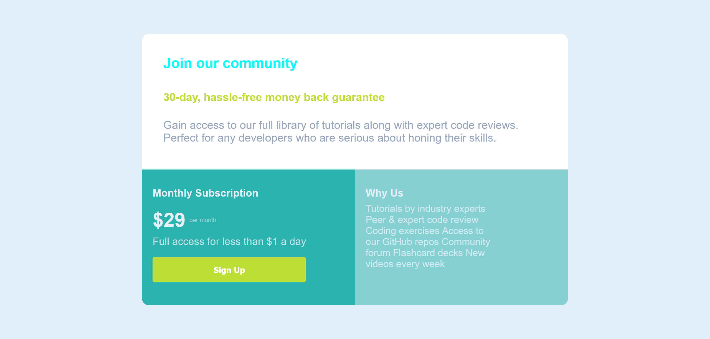

# Frontend Mentor - Single price grid component solution

This is a solution to the [Single price grid component challenge on Frontend Mentor](https://www.frontendmentor.io/challenges/single-price-grid-component-5ce41129d0ff452fec5abbbc). Frontend Mentor challenges help you improve your coding skills by building realistic projects. 

## Table of contents

- [Overview](#overview)
  - [The challenge](#the-challenge)
  - [Screenshot](#screenshot)
  - [Links](#links)
- [My process](#my-process)
  - [Built with](#built-with)
  - [What I learned](#what-i-learned)
  - [Continued development](#continued-development)
  - [Useful resources](#useful-resources)
- [Author](#author)
- [Acknowledgments](#acknowledgments)

## Overview

### The challenge

Users should be able to:

- View the optimal layout for the component depending on their device's screen size
- See a hover state on desktop for the Sign Up call-to-action

### Screenshot


 - Screenshot of the project.

### Links

- Live Site URL: [Live Server URL](https://your-live-site-url.com)

## My process

### Built with

- Semantic HTML5 markup
- CSS custom properties
- Flexbox
- CSS Grid
- Mobile-first workflow

### What I learned

I have learned how to make simple templates using HTML and CSS with help of flex properties and grid properties .

Observe below code for given project.

```html
<!DOCTYPE html>
<html lang="en">

<head>
    <meta charset="UTF-8">
    <meta name="viewport" content="width=device-width, initial-scale=1.0">
    <link rel="icon" type="image/png" sizes="32x32" href="./images/favicon-32x32.png">
    <link rel="stylesheet" href="style.css">
    <title>Frontend Mentor | Single Price Grid Component</title>
</head>

<body>

    <div id="wrapper">
        <div class="card">
            <div class="box b1">
                <div class="content">
                    <div class="cyan">
                        <h4>
                            Join our community
                        </h4>
                    </div>
                    <div class="yellow">
                        <h5>
                            30-day, hassle-free money back guarantee
                        </h5>
                    </div>
                    <div class="gblue">
                        <p>
                            Gain access to our full library of tutorials along with expert code reviews.
                            Perfect for any developers who are serious about honing their skills.
                        </p>
                    </div>
                </div>
            </div>
            <div class="box b2">
                <div class="content">
                    <div class="lgray">
                        <h4>
                            Monthly Subscription
                        </h4>
                    </div>
                    <div class="lgray">
                        <h5 class="price">
                            &dollar;29<span>per month</span>
                        </h5>
                        <p class="lgrayo">
                            Full access for less than &dollar;1 a day
                        </p>
                    </div>
                    <div class="button">
                        <button>Sign Up</button>
                    </div>
                </div>
            </div>
            <div class="box b3">
                <div class="content">
                    <div class="lgray">
                        <h4>
                            Why Us
                        </h4>
                    </div>
                    <div class="lgrayo pad">
                        <p>
                            Tutorials by industry experts
                            Peer &amp; expert code review
                            Coding exercises
                            Access to our GitHub repos
                            Community forum
                            Flashcard decks
                            New videos every week
                        </p>
                    </div>
                </div>
            </div>
        </div>
    </div>

    <footer>
        <p class="attribution">
            Challenge by <a href="https://www.frontendmentor.io?ref=challenge" target="_blank">Frontend Mentor</a>.
            Coded by <a href="#">Prasanna Pandhare</a>.
        </p>
    </footer>
</body>

</html>
```

```css
@import url(https://fonts.google.com/specimen/Karla);

* {
    margin: 0;
    padding: 0;
    box-sizing: border-box;
}

#wrapper {
    font-family: "Karla", sans-serif;
    height: 100vh;
    width: 100%;
    background-color: hsl(204, 62%, 93%);
    display: flex;
    justify-content: center;
    align-items: center;
}

.card {
    font-family: "Karla", sans-serif;
    width: 60%;
    height: 80%;
    display: grid;
    grid-template-columns: 50% 50%;
    grid-template-rows: 50% 50%;
    grid-template-areas:
        "b1 b1"
        "b2 b3";
    justify-items: center;
    align-items: center;
    border-radius: 15px;
    overflow: hidden;
}

.box {
    width: 100%;
    height: 100%;
    display: flex;
    justify-content: center;
    align-items: center;
}

.content {
    width: 90%;
    height: 80%;
}

.b1 {
    grid-area: b1;
    background-color: white;
}

.cyan {
    margin-top: 2%;
    color: cyan;
    font-weight: 700;
    font-size: 190%;
}

.yellow {
    margin-top: 5%;
    font-weight: 700;
    color: hsl(71, 71%, 54%);
    font-size: 180%;
}

.gblue {
    margin-top: 4%;
    font-size: 150%;
    font-weight: lighter;
    color: hsl(218, 22%, 67%);
}

.b2 {
    grid-area: b2;
    background-color: hsl(179, 62%, 43%);
}

.lgray {
    color: hsl(204, 43%, 93%);
    margin-top: 2%;
    font-size: 140%;
}

.price {
    margin-top: 5%;
    font-size: 190%;
    display: flex;
    align-items: center;
}

span {
    font-size: small;
    font-weight: lighter;
    margin-left: 2%;
    color: hsla(204, 43%, 93%, 60%);
}

.lgrayo {
    margin-top: 2%;
    margin-bottom: 5%;
    color: hsla(204, 43%, 93%, 80%);
}

button {
    border: none;
    font-weight: bold;
    font-size: 110%;
    border-radius: 5px;
    width: 80%;
    height: 55px;
    color: white;
    background-color: hsl(71, 71%, 54%);
    cursor: pointer;
}

.b3 {
    grid-area: b3;
    background-color: hsla(179, 62%, 43%, 50%);
}

.pad {
    padding-right: 30%;
    font-size: 130%;
}

.attribution {
    font-size: 11px;
    text-align: center;
}

.attribution a {
    color: hsl(228, 45%, 44%);
    text-decoration: none;
}

@media screen and (width<=526px) {
    #wrapper {
        display: flex;
        flex-direction: column;
        justify-content: center;
        align-items: center;
        min-width: 375px;
        height: 100%;
        padding-left: 15px;
        padding-right: 15px;
        padding-top: 100px;
        padding-bottom: 100px;
    }

    .card {
        height: 90%;
        width: 90%;
        display: grid;
        grid-template-columns: 100%;
        grid-template-rows: 40% 30% 30%;
        grid-template-areas:
            "b1"
            "b2"
            "b3";
    }

    .b1 {
        grid-area: b1;
    }

    .b2 {
        grid-area: b2;
    }

    .b3 {
        grid-area: b3;
    }

    .content {
        border-radius: 15px;
        height: auto;
    }

    button {
        margin-bottom: 3%;
    }

    .b3 .lgray {
        padding-top: 4%;
    }

    .attribution {
        text-align: center;
        font-size: 9px;
    }
}

@media screen and (width<=375px) {

    #wrapper {
        height: 100%;
        padding-left: 15px;
        padding-right: 15px;
        padding-top: 100px;
        padding-bottom: 100px;
    }

    .card {
        height: 90%;
        width: 90%;
        display: grid;
        grid-template-columns: 100%;
        grid-template-rows: 50% 25% 25%;
        grid-template-areas:
            "b1"
            "b2"
            "b3";
        gap: 1.3%;
    }

    .b1 {
        grid-area: b1;
    }

    .b2 {
        grid-area: b2;
    }

    .b3 {
        grid-area: b3;
    }


    .content {
        border-radius: 15px;
        height: auto;
    }

    button {
        margin-bottom: 3%;
    }

    .b3 .lgray {
        padding-top: 4%;
    }

    .attribution {
        text-align: center;
        font-size: 4px;
    }

}
```

### Continued development

I am trying to improve my skills in media queries.

### Useful resources

- [MDN Docs](https://developer.mozilla.org/en-US/) - Helped me in various learnings. 

## Author

- Website - [Prasanna Pandhare](https://www.your-site.com)
- Frontend Mentor - [@Prasannapandhare](https://www.frontendmentor.io/profile/Prasannapandhare)

## Acknowledgments

I understood the importance of CSS in designing HTML structure.
As well as understood about responsive websites.